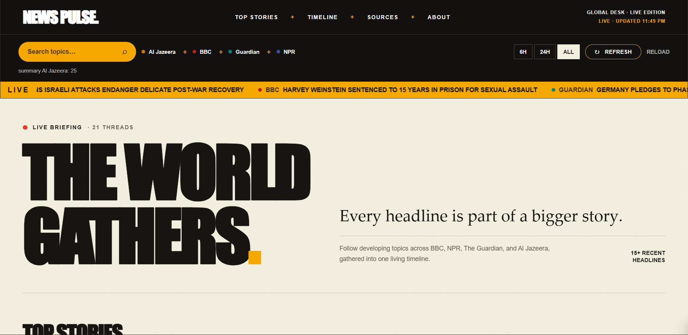
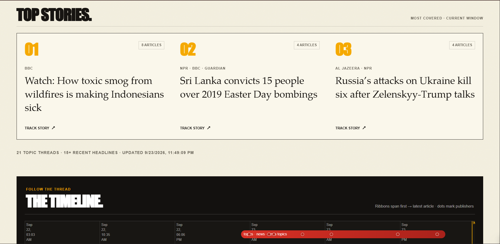
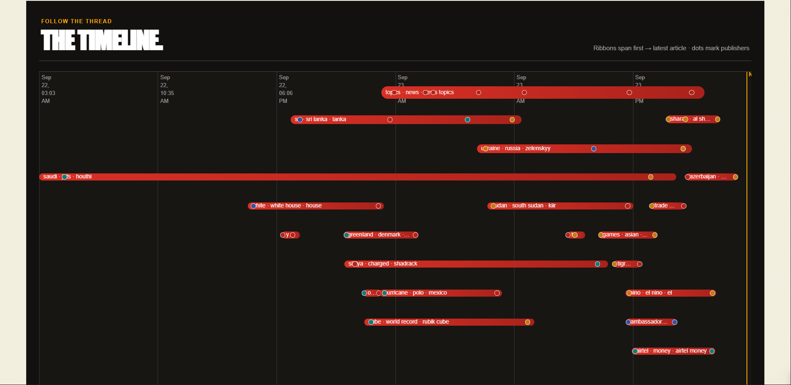
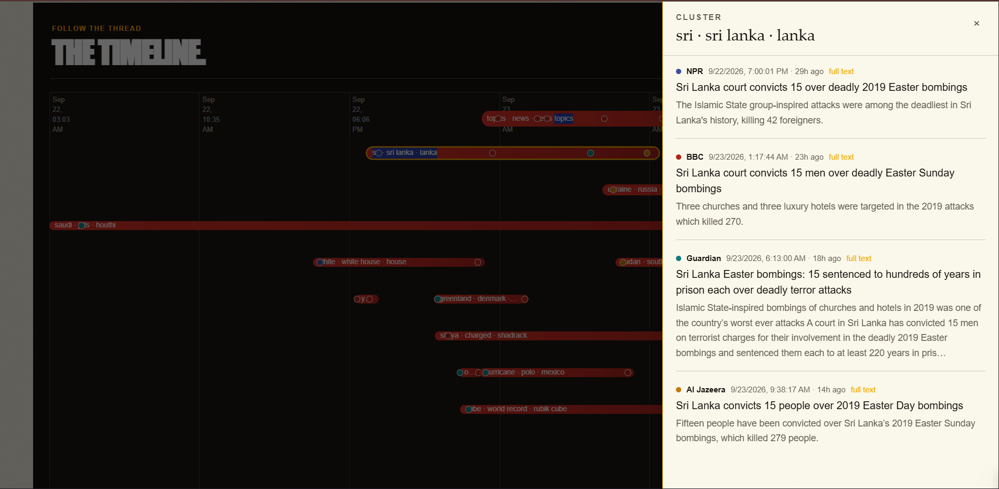

# News Pulse

News Pulse collects recent articles from BBC, NPR, The Guardian, and Al Jazeera, groups textually related coverage into topic clusters, and displays those clusters on an interactive timeline. The project was built as a full-stack developer assessment using Python, Node.js/Express, Next.js/React, and PostgreSQL.

## Live project

- **Live demo:** [Open News Pulse](https://news-pulse-5a6t-seven.vercel.app/)
- **Frontend:** [https://news-pulse-5a6t-seven.vercel.app/](https://news-pulse-5a6t-seven.vercel.app/)
- **Backend API:** [https://news-pulse-api-6cqx.onrender.com](https://news-pulse-api-6cqx.onrender.com)
- **Health check:** [https://news-pulse-api-6cqx.onrender.com/health](https://news-pulse-api-6cqx.onrender.com/health)
- **Video walkthrough:** [Watch the 2–3 minute demo](https://youtu.be/o7lZezrXtnc)

The frontend may be slow to respond on its first visit if the free-tier API has gone idle; it retries while the API wakes up.

## Screenshots

### Dashboard and live coverage



### Top stories



### Timeline



### Cluster details



## Features

- Fetches and normalizes RSS stories from four publishers: BBC, NPR, The Guardian, and Al Jazeera.
- Extracts article text where available, while continuing when a publisher page cannot be parsed.
- Avoids repeat inserts using canonicalized article URLs and a unique URL constraint.
- Groups articles published within a configurable recent window using TF-IDF and cosine similarity.
- Provides a timeline, top stories, a recent-headline ticker, source filters, time filters, topic search, and cluster details linking to original articles.
- Lets a user trigger a fresh ingestion run and poll its status from the frontend.

## Architecture and data flow

```text
RSS feeds
   ↓
Python pipeline (fetch → normalize → extract → deduplicate → cluster)
   ↓
PostgreSQL (articles and cluster membership)
   ↓
Express REST API
   ↓
Next.js / React frontend (filters, story details, timeline)

Refresh data → POST /api/ingest/trigger → Python pipeline subprocess
```

The Python pipeline is in `pipeline/`. The Express API is in `backend/`, and the Next.js frontend is in `frontend/`. The database schema is in `database/migrations/001_init.sql`. The API applies the schema when it starts; the pipeline also applies it before ingesting.

### Topic grouping approach

The project uses **TF-IDF with cosine similarity** (the assessment's Option B). For each article, the pipeline combines its title and RSS summary with up to the first 800 characters of extracted article text, when available. Scikit-learn's `TfidfVectorizer` removes English stop words, considers single words and two-word phrases, and creates a vector of weighted terms for each article.

The pipeline calculates cosine similarity for each article pair. Pairs at or above `SIMILARITY_THRESHOLD` are connected; connected components containing at least two articles become clusters. Each cluster label is formed from up to three of its strongest average TF-IDF terms. The frontend plots the cluster's earliest and latest publication times and individual article timestamps.

The default similarity threshold is `0.28`; it is an initial configurable setting, not a value claimed to be validated against a labeled evaluation set. A lower threshold tends to connect more articles and may produce broader clusters; a higher threshold tends to produce fewer, tighter clusters.

**Known limitation:** similarity is based on overlapping text, not an understanding of events. A cluster can include articles linked through intermediate matches even when every pair is not strongly similar. Similar wording does not guarantee that two outlets are reporting the same real-world event, and different wording can cause coverage of one event to split across clusters. Threshold tuning and evaluation against manually reviewed examples would improve confidence in cluster quality.

## API endpoints

All application endpoints use the `/api` prefix.

| Endpoint | Purpose |
|---|---|
| `GET /health` | Checks API and database connectivity. |
| `GET /api/articles?limit=15` | Lists recent articles; `limit` must be an integer from 1 to 50. |
| `GET /api/clusters?sources=BBC,NPR` | Lists clusters, with an optional source filter. |
| `GET /api/clusters/:id` | Returns a cluster and its articles in chronological order. |
| `GET /api/timeline` | Returns timeline clusters, time bounds, article points, sources, and intensity. |
| `POST /api/ingest/trigger` | Starts the Python ingestion pipeline and returns a job ID. |
| `GET /api/ingest/status/:jobId` | Returns the status and recent logs for an ingestion job. |

## Configuration

Copy `.env.example` to `.env` at the repository root and set the values for your environment. Do not commit real credentials.

| Variable | Purpose | Default / example |
|---|---|---|
| `DATABASE_URL` | PostgreSQL connection string used by the API and pipeline. | Local example is in `.env.example`. |
| `PORT` | Express API port. | `43101` |
| `FRONTEND_URL` / `CORS_ORIGIN` | Allowed frontend origin(s) for API requests. | `http://localhost:43100` |
| `PYTHON_BIN` | Python executable launched by the API. | `python3` |
| `SIMILARITY_THRESHOLD` | Minimum cosine similarity for linking article pairs. | `0.28` |
| `CLUSTER_DAYS` | How many recent days to include when rebuilding clusters. | `3` |
| `MAX_PER_FEED` | Maximum RSS items read per publisher per run. | `40` |
| `NEXT_PUBLIC_API_URL` | API base path used by frontend requests. | `/news-api` locally with the Next.js rewrite. |
| `API_INTERNAL_URL` | Upstream API target for the Next.js `/news-api` rewrite. | `http://127.0.0.1:43101` locally. |

## Run locally

Prerequisites: Node.js 22+, Python 3.11+, and Docker with Docker Compose.

1. Create the environment file and start PostgreSQL:

   ```bash
   cp .env.example .env
   docker compose up -d
   ```

2. Install Python dependencies and run the pipeline once. The `DATABASE_URL` in `.env` should point to the local database shown in `.env.example`.

   ```bash
   python -m venv .venv
   # macOS/Linux:
   source .venv/bin/activate
   # Windows PowerShell:
   # .venv\Scripts\Activate.ps1
   pip install -r pipeline/requirements.txt
   python -m pipeline.main
   ```

3. In one terminal, start the API:

   ```bash
   cd backend
   npm install
   npm run dev
   ```

4. In another terminal, start the frontend:

   ```bash
   cd frontend
   npm install
   npm run dev
   ```

   Open `http://localhost:43100`. The frontend proxies `/news-api/*` to the API at `http://127.0.0.1:43101` using `frontend/next.config.ts`. If your API runs elsewhere, set `API_INTERNAL_URL` for the Next.js process.

To run the pipeline manually again, use `python -m pipeline.main`. Optional command-line arguments include `--days 3` and `--threshold 0.28`.

### Example API requests

```bash
curl http://localhost:43101/health
curl http://localhost:43101/api/timeline
curl "http://localhost:43101/api/clusters?sources=BBC,NPR"
curl -X POST http://localhost:43101/api/ingest/trigger
curl http://localhost:43101/api/ingest/status/<jobId>
```

## Deployment

The deployment configuration in this repository is set up for a split frontend and API deployment:

- **Frontend:** deploy `frontend/` to Vercel or another Next.js host. Set `NEXT_PUBLIC_API_URL` to `/news-api` when using the rewrite, and set `API_INTERNAL_URL` to the API's reachable origin for that rewrite.
- **API and Python pipeline:** deploy the root `Dockerfile` using `render.yaml`. The image installs Python dependencies and Node dependencies; the API starts the Python pipeline as a subprocess when ingestion is triggered.
- **Database:** use a hosted PostgreSQL database, such as Neon. Set `DATABASE_URL` in the API service environment. The schema is applied automatically at API startup and before each pipeline run.

On the API host, set `DATABASE_URL`, `FRONTEND_URL` (or `CORS_ORIGIN`), and any desired clustering settings in the host's environment configuration. `render.yaml` leaves database and frontend-origin values for configuration in the Render dashboard. Keep secrets out of the repository. Configure the frontend's API rewrite to reach the API service, and ensure the allowed CORS origin matches the deployed frontend.

## Assessment submission checklist

- [x] Source code organized into pipeline, backend, and frontend components.
- [x] Include the live frontend and backend URLs above.
- [x] Include the 2–3 minute video walkthrough link above.
- [x] Document setup, architecture, data sources, grouping approach, parameter choice, and a known limitation.

## License and attribution

MIT. See [`LICENSE`](LICENSE). This is an original implementation; the README describes its inspiration as Khabar Threads.
